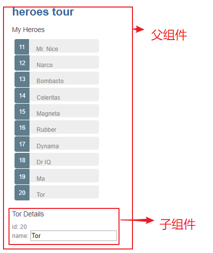

# vue 的数据回流（双向绑定）
vue 的官网上为定义，它的props为单向数据流，prop 能将父级组件的信息传递到子组件，并且进行更新，但是反过来却不行。

[vue官网-单向数据流](https://cn.vuejs.org/v2/guide/components-props.html#%E5%8D%95%E5%90%91%E6%95%B0%E6%8D%AE%E6%B5%81)

但是，有时候我们需要将 prop 在子组件中进行修改，并且回流到父组件中。比如，我们想将下图子组件显示的hero name 修改的同时，对应父组件上的name都同时修改。这时，就需要数据回流了。


vue给表单提供了 v-model方法。
通过v-model，（hero对象通过prop传入）hero.name在子组件的改变，也将传递到父组件。实现双向绑定。
```html
 <!-- 子组件 input 修改 hero.name -->
<input type="text" v-model="hero.name">
<!-- 父组件中，selectedHero绑定到hero中通过prop传递到子组件 -->
<hero-detail :hero="selectedHero"/>

```

还有一个问题出现了，v-model的简单使用只能在部分表单元素上实现，[v-model使用](https://cn.vuejs.org/v2/api/#v-model)。
所以vue提供了[自定义v-model](https://cn.vuejs.org/v2/guide/components-custom-events.html)。

子组件中：
```html
<input type="text" :value="hero.name" @change="$emit('change', {id: hero.id, name:$event.target.value})" />
    
```
```js
props: {
    hero: Object,
},
model: {
    prop: 'hero',
    event: 'change',
},
```
父组件：
```html
<hero-detail v-model="selectedHero"/>
<!-- 然后将selectedHero的值重新更新到heroList中 -->
```

v-model简便写法： [.sync](https://cn.vuejs.org/v2/guide/components-custom-events.html#sync-%E4%BF%AE%E9%A5%B0%E7%AC%A6)
```html
<!-- 子级组件 -->
<input type="text" :value="hero.name" @change="$emit('update:name', $event.target.value)" />
<!-- 父级组件 -->
<hero-detail v-bind.sync="selectedHero" />
```

双向绑定 -- 类似react数据回流写法

子组件 通过监听父组件传入的值，并返回参数
```html
<input type="text" :value="hero.name" @input="heroChange($event)">
```
```js
props: ['hero'],
    methods: {
    heroChange(event) {
        this.$emit('my-event', event.target.value);
    },
},
```

父组件：组件接受返回的属性并更新。
```html
<hero-detail
:hero="selectedHero"
v-on:my-event="listen($event)" />
```
```js
methods: {
    listen(event) {
        this.selectedHero.name = event;
    },
},
```
但是 v-model 自定义和.sync，将返回一个新的object，这意味着我们将重新去更新heroList，这是一件很麻烦的事情。